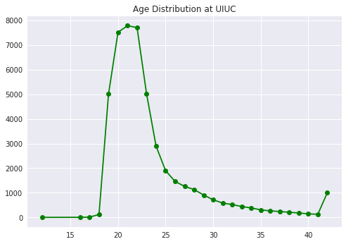
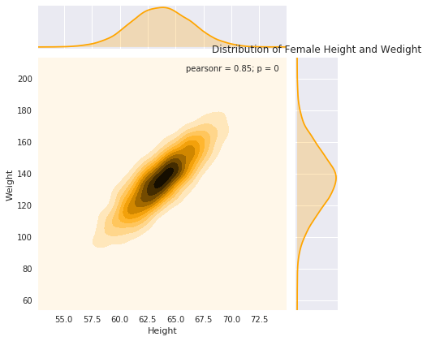
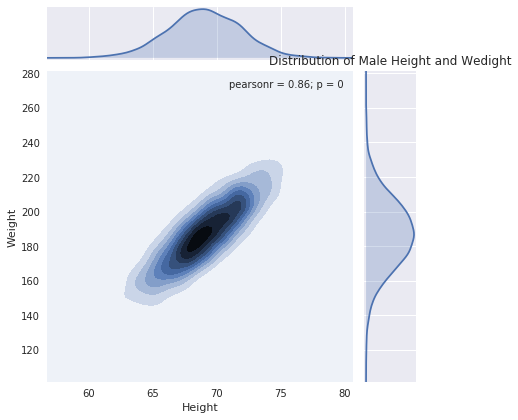
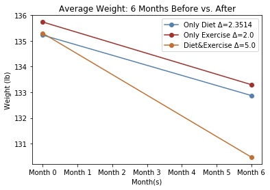
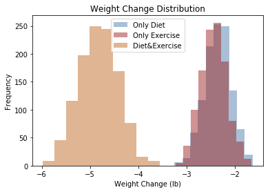
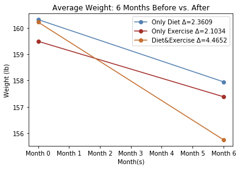
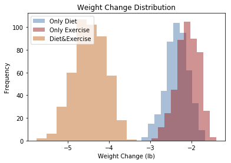
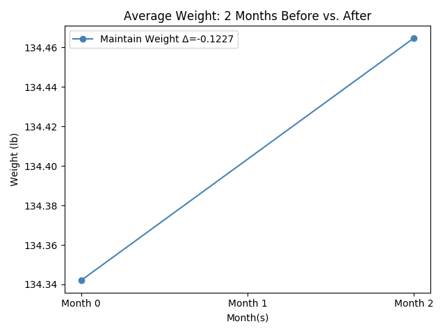

# 590PR Final_Project

# Title: UIUC Student Body Weight Simulation

## Team Member(s):
*  Linxi Liu (LinxiLoveCS)

    Found distribution for body weight and heights and UIUC student gender; Defined functions of heart rate, calorie intakes, calorie burn, and population generation; Coded the user input part; Wrote the README
*  Junyi Zheng (Rickeyddddx)
    
    Found distribution for UIUC student age and exercise time; Defined function that generates PERT distribution; Added doc tests; Analyzed the simulation results; Tested the code to find bugs
*  Shijia Zhang (zsjgithub654)

    Found distribution for exercise intensity; Added doc tests; Analyzed the simulation results; Fixed typos in comments of the code; Tested the code to find bugs

# Monte Carlo Simulation Scenario & Purpose:
   
   Nowadays, more and more people, especially college students, are minding their body weight. Approximate 58% male students and 87% of female students are not satisfied with their body weight. There are so many possible ways to do this. I have heard about methods such as only eating apples for a week doing HIIT for 3 hours but eating whatever you want, and there are so many more ways out there. But which way is the most effective way? Diet or Exercise? **In this Monte Carlo Simulation, you will have the chance to find out yourself!**

   This Program simulates students from UIUC (i.e. the simulated population will have the same age and gender distribution as the demographics as UIUC). Each student will choose his/her goal to lose, maintain, or gain (only for males) weight. For those who want to lose or gain weight, they will have different plans to reach their goals: only dieting, only exercising, and combining dieting and exercising. The program will output students' final weight and compare it with the original weight to show you how much their weight change and which way is most effective. 

## Simulation's variables of uncertainty
### Age: age of the simulated students
    We found the real age distribution from UIUC Demographic website (http://www.dmi.illinois.edu/stuenr/abstracts/FA17_ten.htm) and followed this distribution when generating students' ages. Age will affect a person's [Basal metabolic rate (BMR)](https://www.google.com/url?sa=t&rct=j&q=&esrc=s&source=web&cd=3&cad=rja&uact=8&ved=2ahUKEwiX2Yz09qDfAhXp6YMKHQwcDyoQFjACegQIBhAL&url=https%3A%2F%2Fwww.verywellfit.com%2Fwhat-is-bmr-or-basal-metabolic-rate-3495380&usg=AOvVaw2Zf4sgbiVRZR42H0GXNfGN) and heart rate which will further affects calories burn during exercise. 
  

### Gender
   We found the real gender distribution from the same website above and followed the real distribution when generating genders as well. Gender will affect BMR and number of calories burnt during exercise. 

### Body Weight & Height
   It has been proved by science that human body weight and height follows a 2D normal distribution. We found real body weight and height data for Americans from (https://www.kaggle.com/mustafaali96/weight-height/downloads/weight-height.csv/1). We studies the data and followed the distribution shown by the data except that we decreased the average male body weight by 27 lbs to make the data more like weights for college students. (Before the adjustment, the average BMI for male is slightly above 25 while according to [the study](http://digitalcommons.unl.edu/cgi/viewcontent.cgi?article=1038&context=nutritiondiss), average BMI for college male student is around 24). We verified the BMI for both male and female and think it represents the body condition for college students pretty well. 

**Female**|**Male**              
-|-
 | 

### Goals
   We randomly select 26%, 14%, and 60% of male to lose, gain, and maintain weight; we randomly chose 75% and 25% percent of female to lose and maintain weight. We believe these percentages are reasonable according to [Kashubeck-West's study](https://www.webmd.com/diet/news/20050428/study-more-women-than-men-desire-weight-loss#2). 

### Plans to hit goals
   For those who wants to lose weight, we divided them evenly into 3 groups: only diet to lose weight, only do exercise to lose weight, and people who do both. For those males who wants to gain weight, we divided them evenly into 2 groups: only diet to gain weight and people who combine diet and exercise. We did not think this is the reality but we could not find an agreement online about the percentages of people with different plans. So we simplified it.

### Diet: calorie cut (diet_monthly)
   People who are on diet (eat less) will cut daily calories by at most 1000 and at least 0 with 250 as the most possible value. We think it is close to reality since 1000 is about the calorie for a whole meal, 250 is about the calorie of a piece of cake. We also assume people on diet can keep eat less for about 90% of the time in a month.

   For the rest 10% of the time, they will have a "break" from the diet and eat slightly more with the highest of 500 calorie (3 pieces of cookies + a small ice cream), lowest of 0, and most frequent 250 (a piece of cake)

### Exercise Time (exercise_monthly)
   We assume people who wants to lose weight spend at least 0, at most 120 minutes, with 60  minutes as the most possible time for exercise every week. We believe this is close to the reality as it fits most of the students schedule well. 

### Daily exercise time multiple  (ex_multiple)
   This multiple will be multiplied to BMR and the result represents how much calorie the person will burn during activities compared to BMR. It has the lowest, most frequent and highest value of 0,0.1, and 0.2. This multiple is for people who wants to maintain their body weights and acording to many researches we found,most people will burn 10% of the BMR during daily activities.

### Daily Calorie intake multiple (mean_multiple)
   This multiple will be multiplied to BMR and the result represents how much calorie the person take compared to BMR. It has the lowest, most frequent and highest value of -0.1,0.1, and 1.5. This multiple is for people who wants to maintain their body weights and since most poeple will burn 10% of their BMR during activities, in order to maintain weight, they will eat 10% of BMR more calories every day.
 

## Analytical Summary of your findings:
*All results are based on population of size 10,000 and months = 6.

### Lose Weight: Diet or Exercise?
In the simulation,plots of both male and female show that all three methods lead to weight loss.**For females,we could see that combination of diet and exercise would contribute to more weight loss**.And plans with only diet or only exercise would lead to weight loss,too.But the weight loss is less compared with combo plan.We can also see a subtle difference between these two plan,choosing only exercise seems to be a little bit more helpful in weight loss than only diet does.**However,things appear to be the opposite for men**.Plan with only diet help men lose more pounds than plan with only exercise,which is interesting.Maybe it is because men eat more than women,and eating less would make their calory intake decrease more than women.

**Female**              
-|-
 | 

**Male**              
-|-
 | 

Overall,females who chose to lose weight lost 3.550 lbs,while males lost 2.9771 lbs,which might indicate that females who choose to lose weight tend to lose more weights than males.

### Wants to maintain the weight? It may be easier for men!
From the plots of maintaining weight of female and male,we could see that women tend to gain more weight than men when they are trying to maintain their current weight.

|
 **Female** 
 |
  **Male**
| 
|-------------------------|-------------------------|
|  |  |

## Instructions on how to use the program:

    Simply run "UIUC_Student_Weight_Simulation.py" and it will display instructions and user input space for you. 
Here is a step by step explanation: 

1. Input the population size you want to generate
2. Input the number of month you want to simulate
3. Now the population has been successfully generated and you will need to specify a group of people of whom you want to see the results. E.g. you may want to see how things go for females who wants to lose weight; or you may want to see how weight has changed for those males who want to maintain, etc. 
4. You can choose to quit the program if you don't find it fun, which will make me feel a little bit sad :( or you could speicify another group  of poeple of whom you want to see the results. 
Hope you enjoy!

## All Sources Used:

* UIUC Demographics: http://www.dmi.illinois.edu/stuenr/abstracts/FA17_ten.htm
* Body weight and height: https://www.kaggle.com/mustafaali96/weight-height/downloads/weight-height.csv/1
* Heart rate: https://www.mayoclinic.org/healthy-lifestyle/fitness/in-depth/exercise-intensity/art-20046887
* Exercise calorie burn: https://www.mayoclinic.org/healthy-lifestyle/fitness/in-depth/exercise-intensity/art-20046887
* Formula used: 
    - BMR
        - Male: 66+(6.23 x Weight)+(12.7 x Height)-(6.8 x Age)
        - Female: 655+(4.35 x Weight)+(4.7 x Height)-(4.7 x Age)
    - Calorie to pounds: generally speaking, 3500 calorie = 1 pound; We also made adjustments to  make it more realistic. 
        - If the calorie change is negative, the adjustment is wl_adj = 0.0002 x days2+0.005 x days; 
        - if the calorie change is positive, the adjustment is 0.0001 x days2+0.027 x days
    - Calorie burnt during exercise
        - Male:((0.2017 x Age) - (0.09036 x Weight) + (Target Heart Rate) x 0.6309) - 55.0969) x Exercise Time/4.184)
        - Female: ((0.074 x Age) - (0.05741 x Weight) + (Target Heart Rate x 0.4472) - 20.4022) x Exercise Time/4.184
